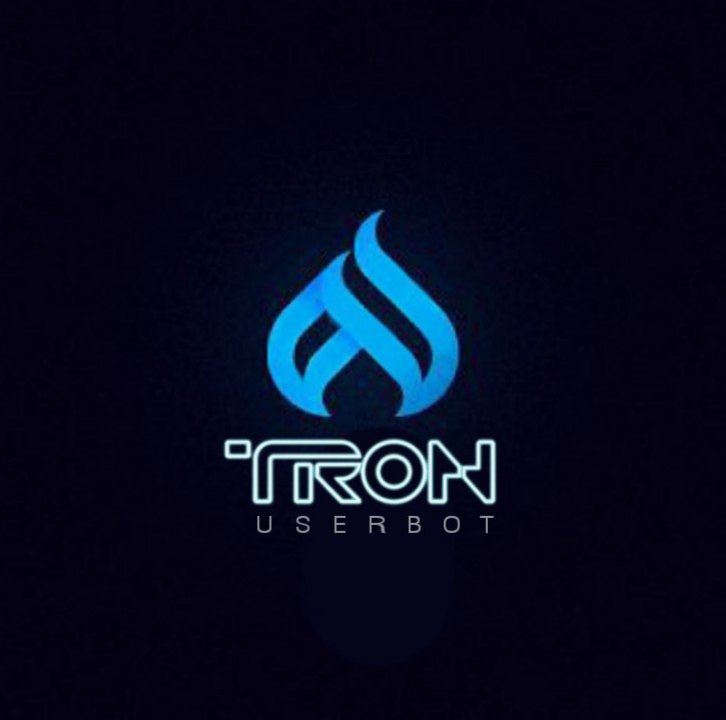

<p align="center">
    <a href="https://github.com/beastzx18/Tron">
        
    </a>
</p>
<h2 align="center">Tron Userbot</h2> 

[](https://github.com/beastzx18/Tron/actions/workflows/codeql-analysis.yml)


## • About

**This is a telegram userbot with an assistant bot, it is written in Python using** [pyrogram](https://github.com/pyrogram/pyrogram) **library.**


## • Necessary vars

<p>1. API_ID</p>

<p>2. API_HASH</p>

<p>3. SESSION</p>

<p>4. PREFIX</p>

<p>5. LOG_CHAT</p>

<p>6. TIME_ZONE</p>

<p>7. TOKEN</p>


## • Deployment

**1. Deploy on heroku**

[](https://heroku.com/deploy)


**2. Deploy on Termux**
><p>

**1. Install termux app in your device ( lastest version )**

**2. Run The code in the termux that are given below:**

`apt update & apt upgrade`

`pkg install python git nano`

`git clone https://github.com/beastzx18/Tron`

`cd Tron`

`nano demo_config.py` 
>Note: Fill those required values from your value.

`python3 -m tronx`

**3. Done, Have fun using tronuserbot.**

</p>

### • Session [ 2 methods ]

<p>

**1. Repl method**

[](https://replit.com/@beastzx18/Tron-Userbot-Session?v=1)

**2. Termux method**

*  ```apt update & apt upgrade```

*  ```pkg install python```

*  ```pkg install git```

*  ```git clone https://github.com/beastzx18/Tron```

*  ```cd Tron```

*  ```python3 session.py```


## • Credits

• MADE WITH 🎉 BY [࿇•ẞᗴᗩSԵ•࿇](https://t.me/beastzx)

