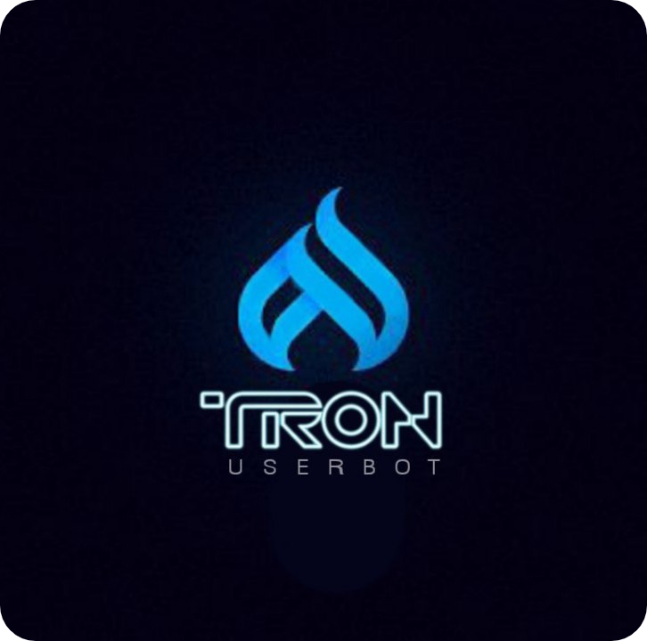

<p align="center">
    <a href="https://github.com/beastzx18/Tron">
        
    </a>
</p>

<h2 align="center">Tron Userbot</h2> 

[](https://github.com/TronUb/Tron/actions/workflows/codeql-analysis.yml)


### Click below on text

<details>
    <summary><b>• About</b></summary>

<br></br>
**This is a telegram userbot with an assistant bot, it is written in pure Python using** [pyrogram](https://github.com/pyrogram/pyrogram) **library.**

</details>


<details>
    <summary>
        <b>• Necessary vars</b>
    </summary>
<br></br>
<p><blockquote>API_ID</blockquote></p>

<p><blockquote>API_HASH</blockquote></p>

<p><blockquote>SESSION</blockquote></p>

<p><blockquote>TRIGGER</blockquote></p>

<p><blockquote>LOG_CHAT</blockquote></p>

<p><blockquote>TIME_ZONE</blockquote></p>

<p><blockquote>TOKEN</blockquote></p>

</details>


<details>
    <summary><b>• Deployment [ 2 methods ]</b></summary>

<br></br>
<details>
    <summary><b>1. Deploy on Heroku</b></summary>

<br></br>
[](https://heroku.com/deploy)

</details>


<details>
    <summary><b>2. Deploy on Termux</b></summary>

<br></br>
<p>1. Install termux app in your device ( lastest version )</p>

<p>2. Run The code given below in termux.</p>

*  ```pkg install python3 git && git clone https://github.com/TronUb/Tron.git && cd ~ && cd Tron && ./start.sh```

<p>3. Enter your details carefully.</p>

<p>4. Done, Have fun using tronuserbot.</p>

<br></br>
</details>
</details>

<details>
    <summary><b>• Session [ 2 methods ]</b></summary>

<br></br>
<details>
    <summary><b>1. Repl method</b></summary>

<br></br>
[](https://replit.com/@beastzx18/Tron-Userbot-Session?v=1)
<br></br>

</details>


<details>
    <summary><b>2. Termux method</b></summary>

<br></br>

*  ```apt update & apt upgrade```

*  ```pkg install python3```

*  ```pkg install git```

*  ```git clone https://github.com/TronUb/Tron.git```

*  ```cd Tron```

*  ```python3 session.py```

<br></br>

</details>
</details>

Disclaimer: i will not be responsible for anything that happens with your account, if it gets banned or limited it will be your fault, imo nothing happened with my account till now.

<br></br>

• MADE WITH 🎉 BY [࿇•ẞᗴᗩSԵ•࿇](https://t.me/beastzx)

